<div align="center">

# 🚦 Traffic Demand Prediction

### AI-Powered Traffic Demand Forecasting using Ensemble Machine Learning

[](https://python.org)
[](https://lightgbm.readthedocs.io/)
[](https://xgboost.readthedocs.io/)
[](https://catboost.ai/)
[]()
[]()

<br/>

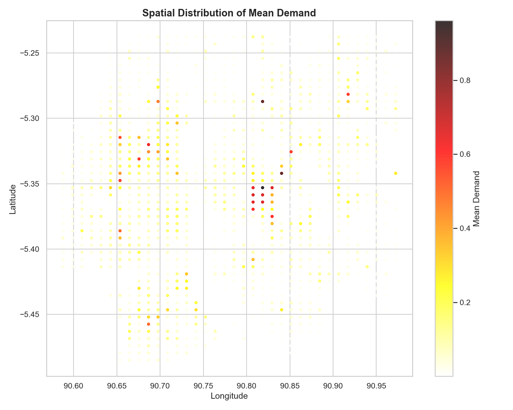

*Spatial distribution of predicted traffic demand across geohash locations*

</div>

---

## 📋 Problem Statement

Cities worldwide are increasingly turning to **AI-powered solutions** to tackle traffic congestion. This project builds a system that provides valuable insights into **passenger travel patterns, booking behavior, and trip cancellations**, enabling data-driven strategies to alleviate traffic congestion and promote efficient mobility.

**Objective**: Predict the `demand` (traffic intensity) at specific geohash locations given temporal, road infrastructure, and weather features.

| Aspect | Detail |
|:---|:---|
| **Target** | `demand` — continuous value in [0, 1] |
| **Train Set** | 77,299 samples × 11 features |
| **Test Set** | 41,778 samples × 10 features |
| **Metric** | `score = max(0, 100 × R²(actual, predicted))` |

---

## 🏗️ Solution Architecture

```
┌─────────────────────────────────────────────────────────────────┐
│                      RAW DATA (train.csv, test.csv)             │
└──────────────────────────────┬──────────────────────────────────┘
                               │
                               ▼
┌─────────────────────────────────────────────────────────────────┐
│                    FEATURE ENGINEERING (57 features)            │
│  ┌──────────┐ ┌──────────┐ ┌──────────┐ ┌───────────────────┐  │
│  │ Temporal  │ │ Spatial  │ │ Weather  │ │ Target Encodings  │  │
│  │ • hour    │ │ • lat    │ │ • encoded│ │ • geohash mean    │  │
│  │ • rush hr │ │ • lon    │ │ • one-hot│ │ • geo×time mean   │  │
│  │ • sin/cos │ │ • prefix │ │ • temp   │ │ • demand stats    │  │
│  └──────────┘ └──────────┘ └──────────┘ └───────────────────┘  │
└──────────────────────────────┬──────────────────────────────────┘
                               │
                               ▼
┌─────────────────────────────────────────────────────────────────┐
│                    MODEL TRAINING (5-Fold CV)                   │
│  ┌──────────────┐  ┌──────────────┐  ┌──────────────────────┐  │
│  │   LightGBM   │  │   XGBoost    │  │      CatBoost        │  │
│  │   R²=0.9921  │  │   R²=0.9930  │  │      R²=0.9933       │  │
│  └──────┬───────┘  └──────┬───────┘  └──────────┬───────────┘  │
│         └──────────────────┼────────────────────┘               │
└────────────────────────────┼────────────────────────────────────┘
                             │
                             ▼
┌─────────────────────────────────────────────────────────────────┐
│              ENSEMBLE (Weighted Average Blending)               │
│           LGB × 0.10  +  XGB × 0.35  +  CAT × 0.55            │
│                       R² = 0.9938                               │
└──────────────────────────────┬──────────────────────────────────┘
                               │
                               ▼
┌─────────────────────────────────────────────────────────────────┐
│                   submission.csv (41,778 × 2)                   │
└─────────────────────────────────────────────────────────────────┘
```

---

## 📊 Results

### Model Performance Comparison

<div align="center">
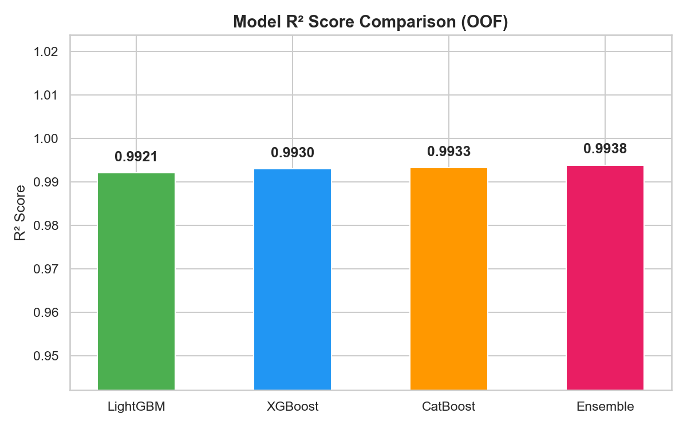
</div>

| Model | OOF R² | Fold 1 | Fold 2 | Fold 3 | Fold 4 | Fold 5 |
|:---|:---:|:---:|:---:|:---:|:---:|:---:|
| 🟢 LightGBM | 0.9921 | 0.9923 | 0.9924 | 0.9915 | 0.9912 | 0.9930 |
| 🔵 XGBoost | 0.9930 | 0.9932 | 0.9930 | 0.9934 | 0.9920 | 0.9936 |
| 🟠 CatBoost | 0.9933 | 0.9936 | 0.9934 | 0.9938 | 0.9923 | 0.9934 |
| 🔴 **Ensemble** | **0.9938** | — | — | — | — | — |

> **Estimated Competition Score: 99.38 / 100**

---

## 🔬 Exploratory Data Analysis

### Demand Distribution
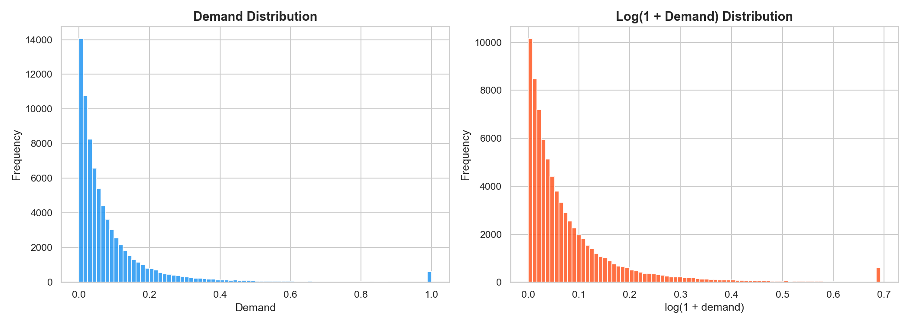

*Demand is heavily right-skewed with most values concentrated near zero, indicating sparse high-demand events.*

### Temporal Patterns
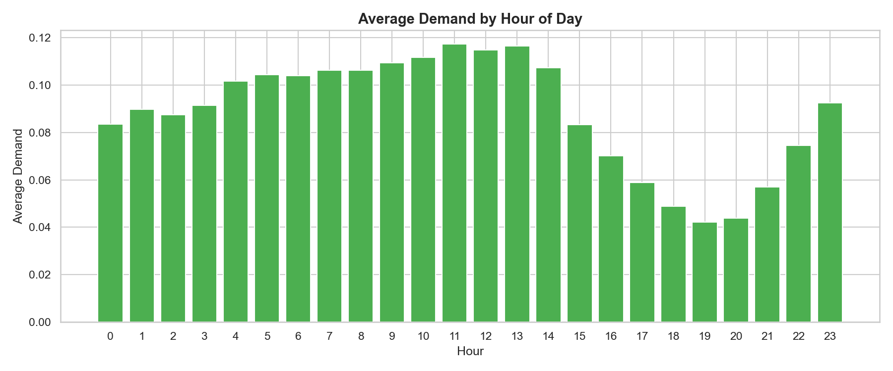

*Clear rush-hour peaks visible at 7–10 AM and 4–7 PM, with lowest demand during late night hours.*

### Road Type & Weather Impact
<p>
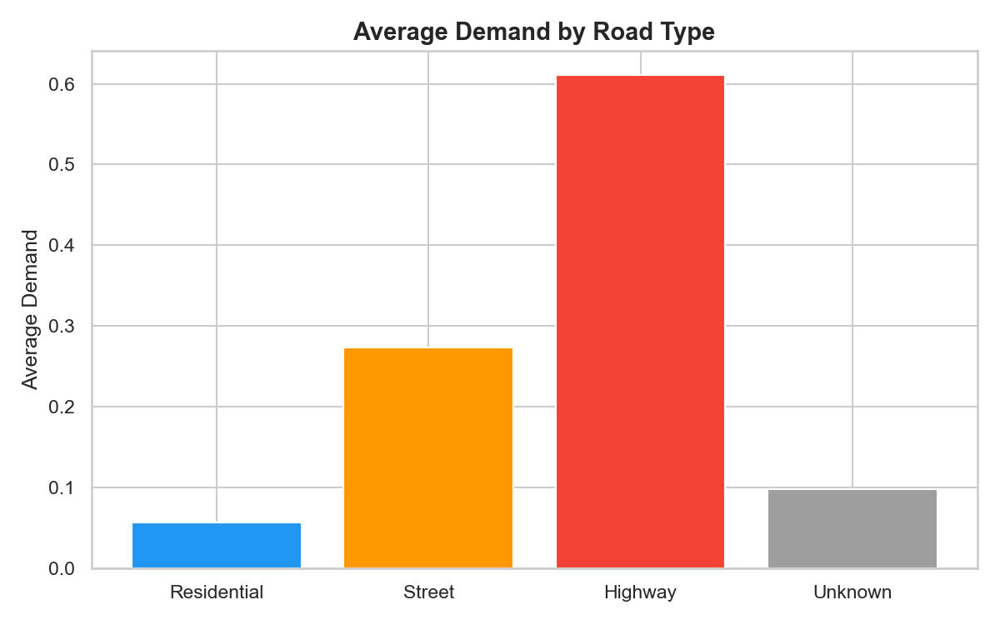
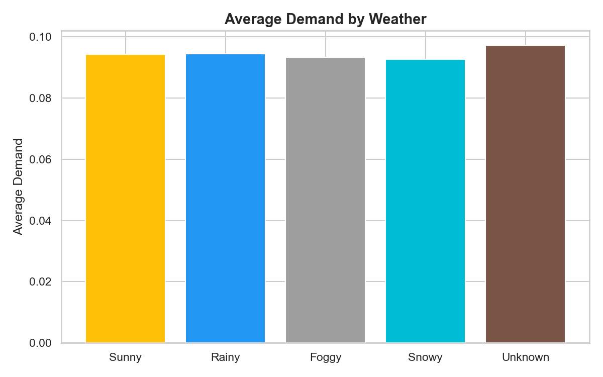
</p>

*Highways show significantly higher demand than residential roads. Sunny weather correlates with higher traffic.*

### Demand Heatmap: Lanes × Hour
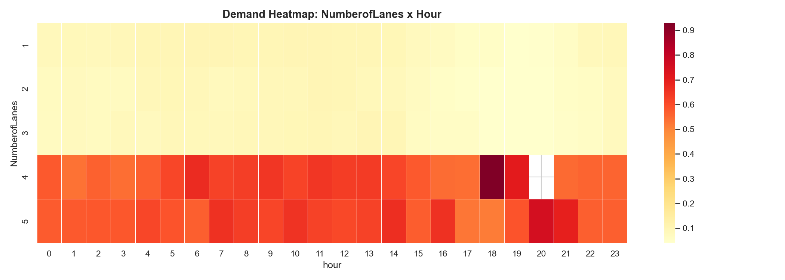

*Multi-lane roads (4-5 lanes) consistently show higher demand, especially during peak hours.*

### Feature Correlations
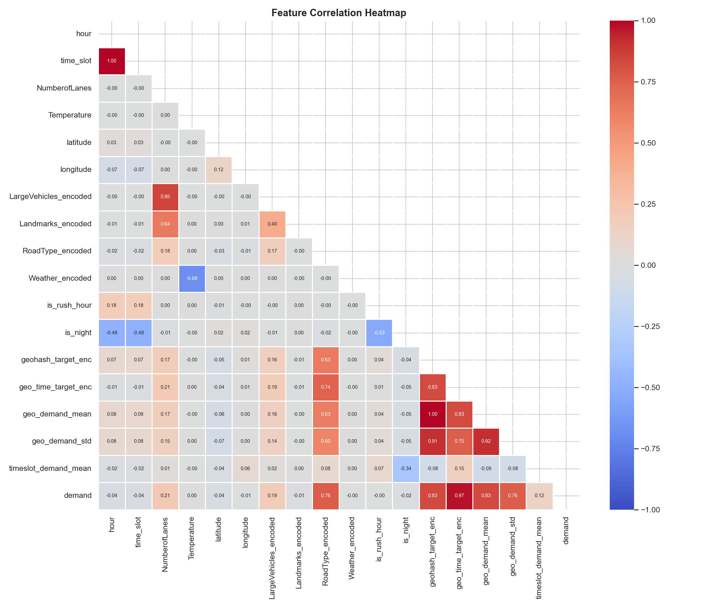

### Feature Importance (LightGBM)
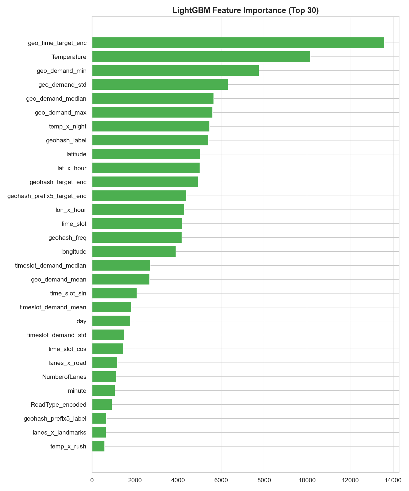

*Target-encoded features (geo_time, geohash mean demand) dominate, followed by spatial coordinates.*

### Prediction Quality
<p>
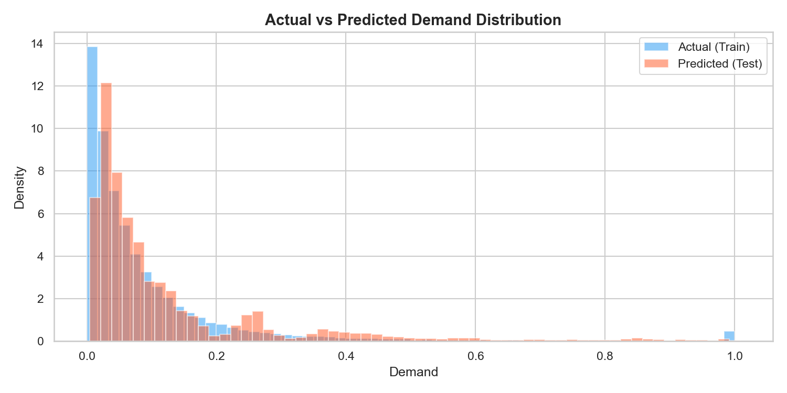
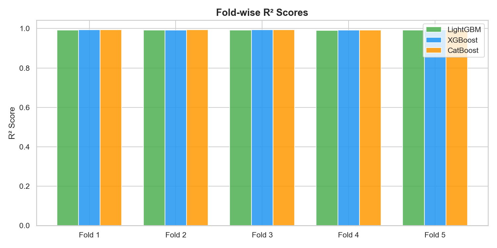
</p>

*Predicted distribution closely matches actual demand. All folds achieve R² > 0.991.*

---

## 🛠️ Feature Engineering

**57 engineered features** across 8 categories:

| Category | Features | Count |
|:---|:---|:---:|
| 🕐 **Temporal** | hour, minute, time_slot, rush hour flags, cyclical sin/cos | 11 |
| 📍 **Spatial** | latitude, longitude, geohash label encodings (4/5/6 char) | 5 |
| 🛣️ **Road** | NumberofLanes, RoadType, LargeVehicles, Landmarks | 4 |
| 🌤️ **Weather** | Weather encoded, one-hot, Temperature, temp_bin | 7 |
| 🎯 **Target Encodings** | geohash, prefix4/5, geo×time, Weather, RoadType | 6 |
| 📈 **Demand Stats** | geo_demand (mean/std/median/min/max), timeslot stats | 8 |
| 🔗 **Interactions** | lanes×rush, lanes×large, lat×hour, temp×rush, etc. | 9 |
| 📊 **Frequency** | geohash_freq, prefix4_density, day, temp_missing | 7 |

### Key Design Decisions

- **Leakage Prevention**: Target encodings computed using **day 48 data only** — since test set is entirely day 49, this prevents temporal leakage
- **Geohash Decoding**: Decoded geohash strings to lat/lon coordinates to handle 10 unseen test locations
- **Smoothed Target Encoding**: Applied Bayesian smoothing (α=10) to prevent overfitting on rare geohashes

---

## 📁 Project Structure

```
Traffic-demand-prediction/
├── 📄 README.md                   # This file
├── 🐍 solution.py                 # Complete Python solution pipeline
├── 📓 solution_notebook.ipynb     # Jupyter notebook version
├── 📊 submission.csv              # Final predictions (41,778 × 2)
├── 🔍 eda.py                      # Exploratory data analysis script
├── 📁 data/
│   └── dataset/
│       ├── train.csv              # Training data (77,299 × 11)
│       ├── test.csv               # Test data (41,778 × 10)
│       └── sample_submission.csv  # Submission format reference
└── 📁 plots/                      # 12 visualization plots
    ├── 01_demand_distribution.png
    ├── 02_demand_by_hour.png
    ├── 03_demand_by_roadtype.png
    ├── 04_demand_by_weather.png
    ├── 05_temperature_vs_demand.png
    ├── 06_heatmap_lanes_hour.png
    ├── 07_spatial_demand.png
    ├── 08_correlation_heatmap.png
    ├── 09_lgb_feature_importance.png
    ├── 10_model_comparison.png
    ├── 11_actual_vs_predicted_dist.png
    └── 12_foldwise_r2.png
```

---

## 🚀 Quick Start

### Prerequisites

```bash
pip install pandas numpy scikit-learn lightgbm xgboost catboost matplotlib seaborn
```

### Run the Solution

```bash
# Clone the repository
git clone https://github.com/thenithin342/Traffic-demand-prediction.git
cd Traffic-demand-prediction

# Run the complete pipeline
python solution.py
```

This will:
1. Load and preprocess the dataset
2. Engineer 57 features
3. Train LightGBM, XGBoost, and CatBoost (5-fold CV each)
4. Create an optimal weighted ensemble
5. Generate all 12 visualization plots in `plots/`
6. Output `submission.csv` ready for upload

---

## 📐 Evaluation Metric

```python
score = max(0, 100 * metrics.r2_score(actual, predicted))
```

The R² (coefficient of determination) measures how well predictions approximate actual values. A score of 100 means perfect prediction; 0 means the model is no better than predicting the mean.

---

## 🧰 Tech Stack

| Library | Version | Purpose |
|:---|:---:|:---|
| Python | 3.13 | Runtime |
| pandas | 2.3.0 | Data manipulation |
| NumPy | 2.2.6 | Numerical computing |
| scikit-learn | 1.7.0 | Preprocessing, metrics, Ridge stacking |
| LightGBM | 4.6.0 | Gradient boosting (base model 1) |
| XGBoost | 3.1.1 | Gradient boosting (base model 2) |
| CatBoost | 1.2.10 | Gradient boosting (base model 3) |
| Matplotlib | 3.10.3 | Visualizations |
| Seaborn | 0.13.2 | Statistical plots |

---

<div align="center">

**Built with ❤️ for smarter cities and better mobility**

</div>
